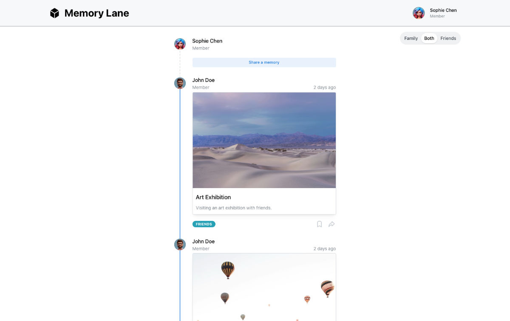

# Memory Lane

Share memories with you Family and Friends !



[Watch the demo video](https://drive.proton.me/urls/48ARNWNK20#zKaGaOhyTNtB)

This project was created as part of a technical assessment for a company, the name of which I will not disclose.  

I had a lot of fun making it and still have many ideas, but I decided to pause for now. 
I completed what was requested of me.

## Problem definition

- Deliver the first iteration.
- Create a solution for friends and family to share memories together in a single place.
- Compile a collection of events that occurred in chronological order.
- Each event should include (at least) a title, a description, a timestamp, and one or more images.

## Technical Stack 

I viewed this as a challenge, so I decided to use a few tools I hadn't used in a while (and some that I had never used before!).

- [NextJS](https://nextjs.org) v15 (Love React!) with Typescript.
- [Mantine UI library](https://mantine.dev/) (highly recommended).
- [Tabler Icons](https://tabler.io/icons) for... icons !
- [Dayjs](https://day.js.org/) for date management. It's smaller than Moment and very enjoyable to use.
- [Sqlite](https://www.sqlite.org/index.html) for the database.
- [Zod](https://zod.dev/) for form validation.
- [Zustand](https://zustand.docs.pmnd.rs/) for global state management.
- [Prisma](https://www.prisma.io) as a database ORM.
- [Figma](https://www.figma.com/) for design and mockups.

## Timeframe

I completed this in three days, roughly 6 to 8 hours each day, which included learning, designing, testing, coding, and having fun.  
I decided not to continue with this, as creating the best application possible was not the point here. However, it might be completed in the future.

1. I started on day one with the vision (see below) and designed a few concepts.
2. The next day, I began coding the structure of the application with the chosen stack.
3. Afterward, I worked on the database and the ORM, adding mock data to help me visualize.
4. I created all the main components (Header, ModeSwitcher, Timeline, UserMenu, etc.).
5. Refine, test, refine, test, refine, test.
6. I cut many ideas that were not meant to be included in the first iteration.
7. I tested more and fixed the last bugs I had.
8. I created this magnificent README.
9. Ta-da!

## My Vision and missing parts

I wanted to keep this simple, clean, and focused on the memories in the timeline, with small buttons for interaction.

However, please note that a few features were not implemented, such as:
- Editing a memory
- Access to user pages (your comments, liked memories, etc.)
- Authentication (We directly assume an identity here; there is no authentication at all)
- Mobile and Tablet: The app should be responsive, but given the timeframe, I preferred not to focus on those.
- Many buttons are included for design purposes but are not clickable.
- Uploading image does not reduce the size of it (weight and resolution), at least for now.
- No Notifications for user actions (as we are the only user adding data, we can saw our data added. No need for notifications)
- Better error management
- There is no testing of any kind (unit tests, integration tests, and so on).
- and a lot more. 

I am sure you, readers, have even more ideas!

## Installation

Please note that `yarn` is required.  
If you do not have it, just install it:

```bash
npm install -g yarn
```

Everything should be set up already.  
Just clone the repository, install the packages, and run it!

```bash
git clone https://github.com/ekarious/memory-lane.git
cd memory-lane
yarn install
yarn run dev
```

## Use

Just have fun with this little `demo` app.

## troubleshooting


